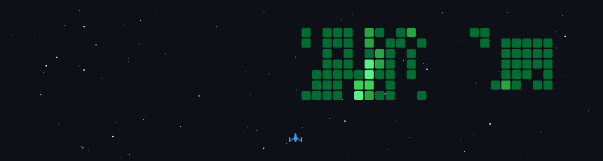

<!--
  GitHub Profile · Dreamt0511
  横幅(banner.svg)与太空射击(space-shooter.gif)为本仓库文件，稳定加载。
  统计卡/连续打卡走在线服务，国内访问略慢属正常，不影响海外 HR。
  space-shooter.gif 由 .github/workflows/update-space-shooter.yml 每天自动生成。
-->

  

  &nbsp;Shenzhen, China&nbsp;
  &nbsp;Focus · <b>AI Agent</b>&nbsp;
  &nbsp;Class of <b>2027</b> · Open to Work&nbsp;
  &nbsp;<b>840+</b> Commits in 2026

---

## &nbsp;About Me

- &nbsp;&nbsp;I build **AI agents that actually get things done** — phone-automation agents, RAG assistants with long-term memory, and self-healing diagnosis systems.
- &nbsp;&nbsp;Solo-built **6+ open-source projects** spanning AI agents, RAG systems, developer tools and 3D visualization.
- &nbsp;&nbsp;Interning at **Nexight**, the team behind [Tutti](https://tutti.sh/en); active in agent-ecosystem OSS.
- &nbsp;&nbsp;**Class of 2027**, seeking AI application / LLM engineering roles in the 2026 fall recruitment season.

## &nbsp;Tech Stack

<table align="center" cellspacing="10">
  <tr>
    <td align="center" style="background:#f0f6ff;border:1px solid #dbeafe;border-radius:14px;padding:8px 6px;"> <small style="color:#64748b;font-weight:600;">Python</small></td>
    <td align="center" style="background:#f0f6ff;border:1px solid #dbeafe;border-radius:14px;padding:8px 6px;"> <small style="color:#64748b;font-weight:600;">LangChain</small></td>
    <td align="center" style="background:#f0f6ff;border:1px solid #dbeafe;border-radius:14px;padding:8px 6px;"> <small style="color:#64748b;font-weight:600;">LangGraph</small></td>
    <td align="center" style="background:#f0f6ff;border:1px solid #dbeafe;border-radius:14px;padding:8px 6px;"> <small style="color:#64748b;font-weight:600;">FastAPI</small></td>
    <td align="center" style="background:#f0f6ff;border:1px solid #dbeafe;border-radius:14px;padding:8px 6px;"> <small style="color:#64748b;font-weight:600;">Kotlin</small></td>
    <td align="center" style="background:#f0f6ff;border:1px solid #dbeafe;border-radius:14px;padding:8px 6px;"> <small style="color:#64748b;font-weight:600;">Android</small></td>
  </tr>
  <tr>
    <td align="center" style="background:#f0f6ff;border:1px solid #dbeafe;border-radius:14px;padding:8px 6px;"> <small style="color:#64748b;font-weight:600;">TypeScript</small></td>
    <td align="center" style="background:#f0f6ff;border:1px solid #dbeafe;border-radius:14px;padding:8px 6px;"> <small style="color:#64748b;font-weight:600;">React</small></td>
    <td align="center" style="background:#f0f6ff;border:1px solid #dbeafe;border-radius:14px;padding:8px 6px;"> <small style="color:#64748b;font-weight:600;">Node.js</small></td>
    <td align="center" style="background:#f0f6ff;border:1px solid #dbeafe;border-radius:14px;padding:8px 6px;"> <small style="color:#64748b;font-weight:600;">Three.js</small></td>
    <td align="center" style="background:#f0f6ff;border:1px solid #dbeafe;border-radius:14px;padding:8px 6px;"> <small style="color:#64748b;font-weight:600;">Docker</small></td>
    <td align="center" style="background:#f0f6ff;border:1px solid #dbeafe;border-radius:14px;padding:8px 6px;"> <small style="color:#64748b;font-weight:600;">Git</small></td>
  </tr>
</table>

## &nbsp;Experience

  
  &nbsp;&nbsp;<b style="font-size:16px;color:#0b3d91;">Full-Stack Development Intern</b>&nbsp;·&nbsp;
  <a href="https://tutti.sh/en" style="color:#1d4ed8;font-weight:600;">Nexight</a>
  (makers of <a href="https://github.com/tutti-os/tutti">Tutti</a> · <a href="https://github.com/tutti-os/tutti">GitHub</a>)
  2026.07 – Present
  
Building <b>Tutti</b> — the first multi-user, multi-agent real-time collaboration space. Coding agents (Claude Code, Codex, Cursor…) work together live in one shared cloud workspace, like Google Docs / Figma but for AI agents.

  

    &nbsp;&nbsp;Working on full-stack development of Tutti's workspace products.
  

  

    
    
    
  

## &nbsp;GitHub Stats

  
  

  

## &nbsp;Space Shooter

Your contributions, as a Galaga-style space battle — updated daily by GitHub Actions.

  

